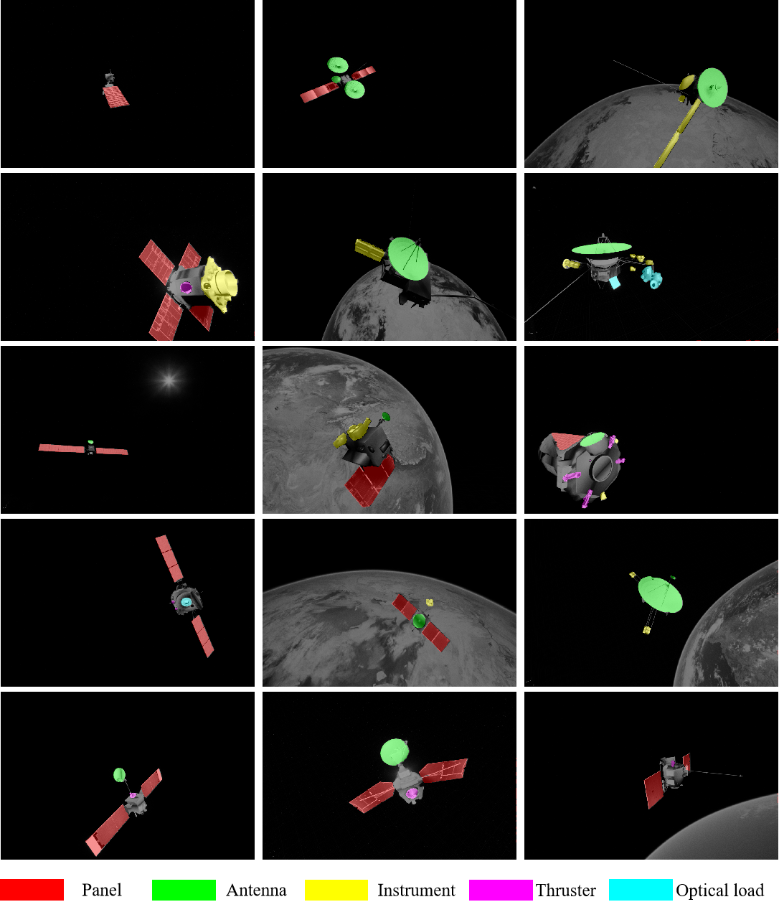
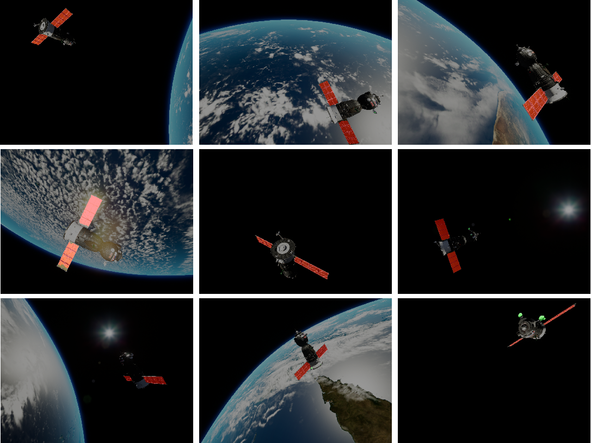

### BUAA-UESD33

* 这是BUAA-UESD33数据集的原始图片，共有10000张。包含33颗卫星，5种特征部件的标注图片

* 数据集可以在这里下载

---

### Satellite models

* 卫星模型中为论文中使用的33颗卫星模型的几何文件，及其对应的结构图。可以在这里下载

* The satellite models and their equipments diagrams in our paper could be downloaded here

* [baidu disk](https://pan.baidu.com/s/15iQRhna1JqZQ2r8gI-O4GA)  Password：BUAA
* [buaa disk](https://bhpan.buaa.edu.cn:443/link/C1F1E003D3AF6B173DFF8B30132DDB9E)
* If you can not download, please contact zy2015128@buaa.edu.cn or 1018450554@qq.com

---

### Abstract

Intellectualization is a significant research hotspot in the development of space technology. Over the decades, the great advancement of deep learning has made us see the possibility of applying semantic segmentation to spacecraft intelligent recognition. Recognizing satellite components is crucial for docking, maintenance, refueling, debris removal, and other tasks. However, the lack of training datasets required for deep learning is an insurmountable difficulty. Based on the needs of space missions and current challenges, this paper first builds the space target dataset. Based on Unreal Engine 4, we establish a space simulation environment that can generate photorealistic photos with high-quality earth background. After collecting and modifying 33 different satellite models, we import them into the environment and generate 10000 images of satellites with various attitudes and abundant backgrounds. Unlike existing datasets, our dataset, named UESD, has five different components, namely solar array, antenna, thruster, instrument, and optical payload, respectively. Furthermore, UESD constructs the earth background as much as possible to avoid the shortcomings of relevant simulation images. After building the dataset, we use a series of state-of-the-art semantic segmentation models to test their performances on our dataset. Using ConvNeXt-Base as the backbone, we also modify a new decoder module based on Upernet. Our method achieves 84.6%and shows satisfactory results compared with all baselines. More experiments are carried out to test the generalization. Results show that even on new satellite targets and a totally different dataset, our method can still recognize the components. The accuracy is slightly reduced but still maintains a high level. Experiments prove the effectiveness of our dataset and method. Ultimately, we analyze existing fully supervised learning shortcomings and look forward to future work.
  

### Benchmark
| Method | BG | Panel | Antenna | Instrument | Thruster | Optical Payload | mIoU | mIoU(no bg) |
| :---: | :---: | :---: | :---: | :---: | :---: |:---: | :---: | :---: |
| Danet| 99.6 | 85.69 | 77.65 | 54.24 | 46.16 | 64.64 | 71.33 | 65.68 |
| Deeplabv3+| 99.83 | 88.67 | 84.98 | 66.53 | 62.25 | 76.99 | 76.99 | 75.88 |
| Ocrnet| 99.69 | 89.03| 83.33 | 63.3 | 56.21 | 73.9 | 77.58 | 73.15 |
| Sfnet| 99.74 | 89.51 | 86.6 | 68.77 | 67.66 | 78.42 | 81.78 | 78.19 |
| VAN-B| 99.77 | 90.97 | 84.99 | 71.24 | 66.65 | 78.36 | 82.0 | 78.44 |
| ConvNext-B| 99.83 | 93.85 | 89.66 | 72.98 | 72.92 | 83.87 | 85.52 | 82.66 |
| Our method | 99.85 | 94.18 | 89.85 | 77.06 | 76.19 | 85.71 | 87.14 | 84.60 |  

### Experiments on different dataset

* val: 23 satellites; test: 10 new satellites; [URSO](https://pedropro.github.io/project/urso/) 

| Method | mIoU-val | mIoU-test | mIoU-URSO |
| :---: | :---: | :---: | :---: |
| SFnet| 86.31 | 81.51 | 78.2 |
| Our method | 93.02 | 83.32 | 81.47 |

---

### Experiment results

* Our dataset

* URSO dataset

---

### Codes
