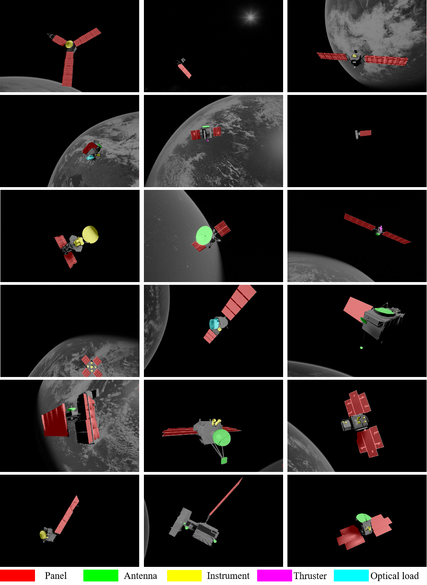
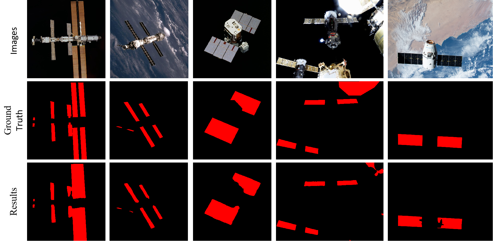

### Intelligent Recognition of Spacecraft Components from Photorealistic Images based on Unreal Engine 4

### BUAA-UESD

* UESD has 10000 satellite images with five distinctive components and 33 different satellites.
* 2022.8.23 Updated 17 new satellite models and 3200 images
* Our paper is under review, so we only give the images. The annotation set will be given later
* UESD can be downloaded here
* Edition1
* Baidu disk https://pan.baidu.com/s/16LHmym9-RBQ7trlmRnkI4Q  Password:BUAA 
* Google Drive https://drive.google.com/file/d/1ZLATSgkaa4Ya8XzJlwTqiAv2Q7_K0KXw/view?usp=sharing
* Edition2
* Google Drive https://drive.google.com/file/d/1l6SyoBvwn9mxpnlgsY8071rFeShUP3sQ/view?usp=sharing

---

### Satellite models

* The satellite models and their equipments diagrams in our paper could be downloaded here

* Edition1
* [Baidu disk](https://pan.baidu.com/s/15iQRhna1JqZQ2r8gI-O4GA)  Password：BUAA
* [Google Drive](https://drive.google.com/file/d/1koIS_FNiqrHcVfvG1JpQRt4E88JbiI0z/view?usp=sharing)
* Edition2
* [Google Drive](https://drive.google.com/file/d/1Sn8xSardyq-7ZL3bU_3CHaXIM8ZFRRr8/view?usp=sharing)
* If you can not download, please contact zy2015128@buaa.edu.cn or 1018450554@qq.com

---

### Abstract

Autonomous and accurate recognition of satellite components is crucial for space tasks such as rendezvous, docking, maintenance, and refueling. Over the decades, the great advancement of deep learning has made us see the possibility of applying semantic segmentation to spacecraft intelligence recognition. However, the lack of training datasets required for deep learning is an insurmountable difficulty. Based on the needs of space missions and current challenges, this paper builds the space target dataset for satellite component recognition. Based on Unreal Engine 4, we establish a space simulation environment that can generate photorealistic images with earth backgrounds. After collecting and modifying 33 different high-quality satellite models, we import them into the environment and generate 10000 satellite images with various attitudes and diverse backgrounds. Unlike existing datasets, our dataset, named UESD, has five distinctive components: solar panel, antenna, thruster, instrument, and optical payload. Furthermore, UESD constructs the earth background as much as possible to avoid the shortcomings of relevant simulation images. After building the dataset, we use a series of state-of-the-art semantic segmentation models to test their performances on our dataset. Using ConvNeXt-Base as the backbone, we propose a new decoder module named LUperNet. Our method achieves 84.6% and shows satisfactory accuracy compared with all baselines. More experiments are carried out to test the generalization ability. Results show that even on new satellite targets and a totally different dataset, our method can still recognize the components and maintain high accuracy. Experiments prove the effectiveness of applying our dataset and method to spacecraft component recognition. 
  

### Benchmark
| Method | BG | Panel | Antenna | Instrument | Thruster | Optical Payload | mIoU | mIoU(no bg) |
| :---: | :---: | :---: | :---: | :---: | :---: |:---: | :---: | :---: |
| Danet| 99.6 | 85.69 | 77.65 | 54.24 | 46.16 | 64.64 | 71.33 | 65.68 |
| Deeplabv3+| 99.83 | 88.67 | 84.98 | 66.53 | 62.25 | 76.99 | 76.99 | 75.88 |
| Ocrnet| 99.69 | 89.03| 83.33 | 63.3 | 56.21 | 73.9 | 77.58 | 73.15 |
| Sfnet| 99.74 | 89.51 | 86.6 | 68.77 | 67.66 | 78.42 | 81.78 | 78.19 |
| VAN-B| 99.77 | 90.97 | 84.99 | 71.24 | 66.65 | 78.36 | 82.0 | 78.44 |
| ConvNext-B| 99.83 | 93.85 | 89.66 | 72.98 | 72.92 | 83.87 | 85.52 | 82.66 |
| Our method | 99.85 | 94.18 | 89.85 | 77.06 | 76.19 | 85.71 | 87.14 | 84.60 |  

---

### Experiment results

* Our dataset

* [URSO](https://pedropro.github.io/project/urso/) dataset

* NASA Results

---

### Codes

* The codes will be given after the reviewing
